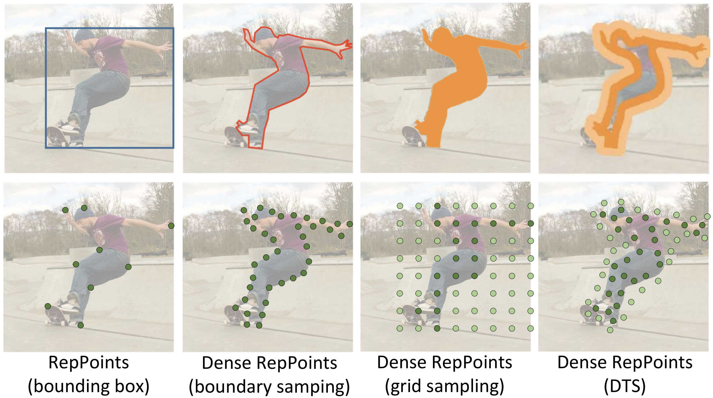
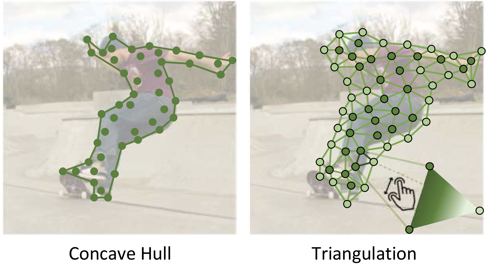
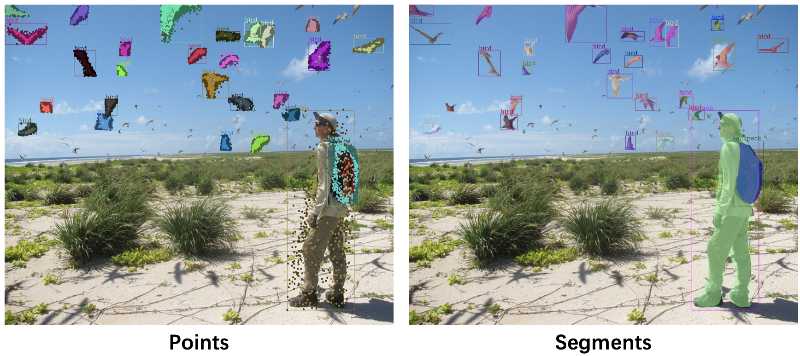

# Dense Reppoints: Representing Visual Objects with Dense Point Sets

The major contributors include [Yinghao Xu*](https://github.com/justimyhxu), [Ze Yang*](https://yangze.tech/), [Han Xue*](https://github.com/xiaoxiaoxh), [Zheng Zhang](https://www.microsoft.com/en-us/research/people/zhez/) ,[Han Hu](https://ancientmooner.github.io/). (* indicates equal contribution)

This repo is an official implementation of ["Dense RepPoints: Representing Visual Objects with Dense Point Sets"](https://arxiv.org/abs/1912.11473) on COCO object detection/instance segmentation. The code is based on [mmdetection](https://github.com/open-mmlab/mmdetection).


## Introduction
**Dense RepPoints** utilizes a dense point set to describe the multi-grained object representation of both box level and pixel level. The following figure illustrates the representation of object segments in different forms using Dense RepPoints. The key techniques to learn such representation are a **distance transform sampling (DTS)** method combined with a **set-to-set supervision** method. In inference, both the **concave hull** and **triangulation** methods are supported. The method is also efficient, achieving near constant complexity with increasing point number. Please touch [arXiv](https://arxiv.org/abs/1912.11473) for more details. 

<div align="center">
       
  <p>Learning Dense RepPoints in Object Detection and Instance Segmentation.</p>
</div>

## Updates
   - Our paper will appear at ECCV2020(06/07/2020)


## Usage

a. Clone the repo, install and download the COCO detection dataset.
```
git clone --recursive https://github.com/justimyhxu/Dense-RepPoints.git
```
Please refer to [INSTALL.md](./docs/INSTALL.md) for installation and dataset preparation in detail.

b. Train with a specific configuration file:
```
./tools/dist_train.sh ${path-to-cfg-file} ${num_gpu} --validate
```
Here is one example:
```
./tools/dist_train.sh configs/dense_reppoints/dense_reppoints_729pts_r50_fpn_1x.py 8 --validate
```

c. Test script:
```
./tools/dist_test.sh  ${path-to-cfg-file}  ${model_path} ${num_gpu} --out ${out_file}
```
Please see [GETTING_STARTED.md](./docs/GETTING_STARTED.md) for the basic usage in detail.

## Citing Dense RepPoints

```
@article{yang2019dense,
  title={Dense reppoints: Representing visual objects with dense point sets},
  author={Yang, Ze and Xu, Yinghao and Xue, Han and Zhang, Zheng and Urtasun, Raquel and Wang, Liwei and Lin, Stephen and Hu, Han},
  journal={arXiv preprint arXiv:1912.11473},
  year={2019}
}
```

## Results and models

The results on COCO 2017val are shown in the table below. **More code and models will be added soon**.


| Method          | Backbone | Anchor    |  convert func | Refine Assigner  | Lr schd | box AP   | mask AP    | Download |
| :----:          | :------: | :-------: | :------:      | :-----:| :-----: | :----:  | :------: | :------:  |
| Dense RepPoints | R-50-FPN | none      | MinMax        | MaxIou           |1x       | 39.4     | 33.8     | [model](https://drive.google.com/file/d/1gAgGTqsrufRleYflrClxI0AUuUC_x1MN/view?usp=sharing) |
| Dense RepPoints | R-50-FPN | none      | MinMax        | ATSS             |1x       | 39.9     | 33.9     | [model](https://drive.google.com/file/d/1jhojzH0N9KI2SpLa-xNQZHZUCU9O5SAE/view?usp=sharing) |
| Dense RepPoints | R-50-FPN | none      | MinMax        | ATSS            |3x (ms-train)       | 43.4     | 37.1     | [model](https://drive.google.com/file/d/1ZPd1iCZGEzqhVs4PwCXdThzqp0ufa_KX/view?usp=sharing) |


**Notes:**

- `R-xx`, `X-xx` denote the ResNet and ResNeXt architectures, respectively. 
- `DCN` denotes replacing 3x3 conv with the 3x3 deformable convolution in `c3-c5` stages of backbone.
- `none` in the `Anchor` column means 2-d `center point` (x,y) is used to represent the initial object hypothesis. 
-  `MinMax` in the `convert func` column is the function to convert a point set to a pseudo box.
- `ms-train` denotes multi-scale training.
- `ATSS` denotes an assigner in [Arxiv](https://arxiv.org/abs/1912.02424).


